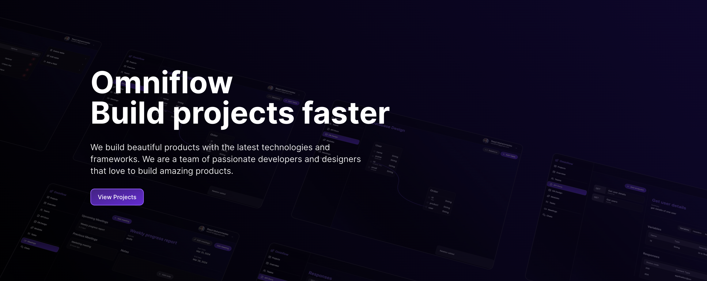

# Omniflow



## Streamlined Project Management Toolkit

Effortless Planning and Management Made Simple with Omniflow.

## Key Features

### Project Management

-   Create and organize projects with ease, facilitating clear goals and timelines.
-   Foster collaboration by inviting team members to projects, ensuring everyone is aligned and informed.

### Team Management

-   Empower team leaders to invite and manage team members, streamlining communication and coordination.
-   Tailor access controls to suit project needs, granting appropriate permissions to team members for seamless collaboration.

### API Documentation

-   Comprehensive documentation of API endpoints, providing clarity and guidance for developers.
-   Customize requests and responses, enabling efficient integration and usage of APIs.

### Database Designing

-   Simplify database management by creating tables and defining relationships intuitively.
-   Ensure data integrity and consistency with clear database structures and connections.

### Module and Task Management

-   Organize project components into modules and sub-modules, simplifying project structure and navigation.
-   Assign tasks to team members and track progress with clear indicators for completed, in progress, and to-do tasks.

### Meeting and Chat

-   Schedule upcoming meetings and access past meeting notes for reference and continuity.
-   Seamlessly join meetings directly from the app, enhancing accessibility and engagement.
-   Facilitate real-time communication among team members through built-in chat functionality, fostering collaboration and issue resolution.

## Architecture

### Microservice Approach

-   Divide the application into 7 distinct services, promoting scalability and maintainability.
-   Enable seamless communication between services using Kafka, ensuring efficient data flow and processing.
-   Optimize traffic management with an Ingress API gateway, enhancing performance and reliability.

### API Documentation

-   Thorough documentation of all API endpoints using Swagger, providing developers with clear and accessible information.
-   Access API documentation conveniently through designated endpoints, promoting ease of use and understanding.

## Getting Started

### Prerequisites

-   Ensure Docker is installed and operational for a smooth development experience.

## Development

### Setup

1. Clone the repository:

    ```sh
    git clone https://github.com/calcom/cal.com.git
    ```

2. Navigate to the project folder:

    ```sh
    cd omniflow
    ```

3. Configure environment variables as instructed in the provided `.env.example` file.

4. Initiate development environment using Docker Compose:

    ```sh
    docker compose watch
    ```

## Technology Stack

**Workflow:** Docker, Kubernetes, Clean Architecture, CI/CD, SOLID Principles, Kafka

**Backend Development:** Node.js, Express.js, TypeScript

**Databases:** MongoDB, PostgreSQL, Sequelize

**Frontend Development:** Next.js, Redux, Tailwind CSS, Framer Motion

**Documentation and API:** Swagger

**Cloud Services:** AWS S3, AWS Lambda

**Monitoring and Logging:** Grafana, Prometheus, Loki, Winston

**Integrations:** Zogocloud, Jest, Supertest, JWT, Nodemailer
